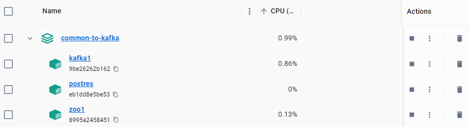
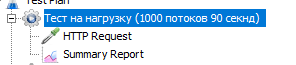
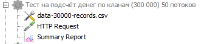
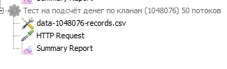

# Запуск

## Docker

Запустить [docker-compose.yml](common-to-kafka%2Fdocker-compose.yml)

Проверить что запушенны контенеры kafka1, postres, zoo1   

## Модули

Запустить [ToKafkaApplication.java](common-to-kafka%2Fsrc%2Fmain%2Fjava%2Fru%2Ftest%2Fskytecgames%2FToKafkaApplication.java)

Запустить [FromKafkaApplication.java](common-from-kafka%2Fsrc%2Fmain%2Fjava%2Fru%2Ftest%2Fskytecgames%2FFromKafkaApplication.java)

Перезапуск [FromKafkaApplication.java](common-from-kafka%2Fsrc%2Fmain%2Fjava%2Fru%2Ftest%2Fskytecgames%2FFromKafkaApplication.java)
обнуляет все результаты по золоту в postgres

# Использование

## Контроллер

GET http://localhost:8099/clan_id/{clanId}/gold/{gold}

{clanId} - id клана (int)

{gold} - измеение по золоту (int)

# Нагрузка

## jMeter

Запуск [generateMessages.jmx](common-to-kafka%2Fsrc%2Fmain%2Fresources%2FjMeter%2FgenerateMessages.jmx)
позволяет эмитировать нагрузка на сервер

три варианта

1. Нагрузочный тест 1000 потоков  
   

2. Тест на правильность подсчета денег 300 000 запросов
     
   результат в [data-30000-records.xlsx](common-to-kafka%2Fsrc%2Fmain%2Fresources%2FjMeter%2Fdata-30000-records.xlsx)

3. Тест на правильность подсчета денег  >1 000 000 запросов
     
   результат
   в [data-1048076-records.xlsx](common-to-kafka%2Fsrc%2Fmain%2Fresources%2FjMeter%2Fdata-1048076-records.xlsx)

## Схема работы

### модуль [common-to-kafka](common-to-kafka)

Все запросы от
контроллера [KafkaController.java](common-to-kafka%2Fsrc%2Fmain%2Fjava%2Fru%2Ftest%2Fskytecgames%2Fcontroller%2FKafkaController.java)
пишутся в брокер сообшений Kafka (1 kafka + 1 zookeeper)

### модуль [common-from-kafka](common-from-kafka)

Получает данные из
kafka  [группирует](common-from-kafka%2Fsrc%2Fmain%2Fjava%2Fru%2Ftest%2Fskytecgames%2Fservices%2FKafkaConsumerService.java)
отправляет  [update](common-from-kafka%2Fsrc%2Fmain%2Fjava%2Fru%2Ftest%2Fskytecgames%2Fservices%2FClanService.java) на
сервер postgres.

На сервере postrges отрабатывает тригерр который, складывает старое значение зоолота с изменяемым значением золота.